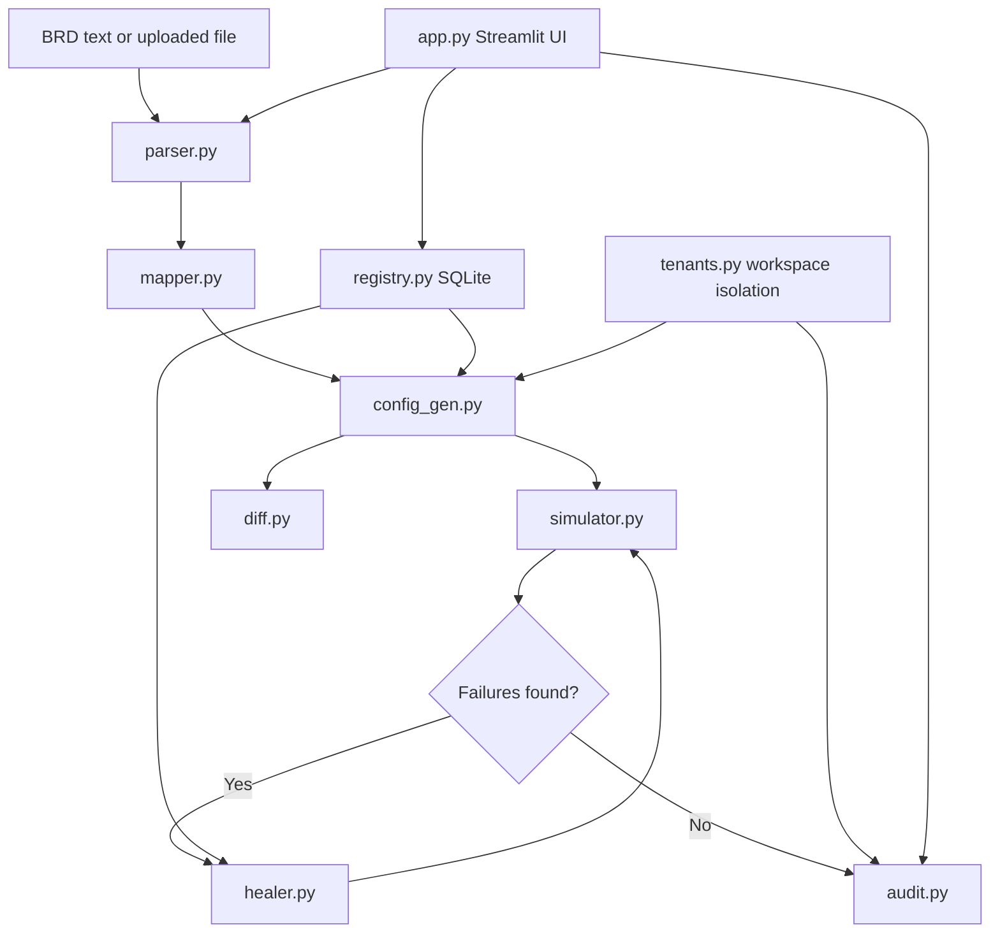

# FinSpark - AI Integration Orchestration Engine

> Configure enterprise fintech integrations from intent, not code.

FinSpark turns BRDs and SOWs into tenant-scoped integration configs, validates them in a sandbox simulation, heals common failures, and records an audit trail for every run. The Streamlit app accepts pasted text or uploaded BRD files in PDF, DOCX, and plain-text formats.

## What is implemented

- BRD parsing with Groq Llama 3.3, plus a local fallback parser when no API key is available
- Semantic field mapping with sentence-transformers when enabled, plus a lexical fallback when embeddings are unavailable
- Per-tenant YAML config generation with versioned history and plain-English diffs
- SQLite-backed adapter registry with Streamlit admin controls
- Inline missing-provider registry creation directly in the app flow
- Sandbox simulation with mandatory vs optional behavior
- Self-healing loop with deterministic fixes and optional Groq-assisted diagnosis
- Append-only tenant audit logs
- Tenant registration/login with isolated config and audit folders
- Docker and docker-compose deployment assets

## Repository layout

```text
finspark-engine/
|-- app.py
|-- document_loader.py
|-- parser.py
|-- mapper.py
|-- config_gen.py
|-- simulator.py
|-- healer.py
|-- audit.py
|-- registry.py
|-- diff.py
|-- tenants.py
|-- templates/
|   `-- integration_config.yaml.j2
|-- docs/
|   `-- architecture.mmd
|-- Dockerfile
|-- docker-compose.yml
|-- requirements.txt
`-- .env.example
```

## Architecture

See [docs/architecture.mmd](docs/architecture.mmd) for the Mermaid source.



## Quick start

### Local

```bash
python -m venv .venv
.venv\Scripts\activate
pip install -r requirements.txt
copy .env.example .env
# add GROQ_API_KEY to .env if you want live LLM parsing/healing
# set FINSPARK_USE_EMBEDDINGS=true if you want sentence-transformer matching
# set FINSPARK_ALLOW_MODEL_DOWNLOAD=true if the model is not already cached
streamlit run app.py
```

### Docker

```bash
copy .env.example .env
# add GROQ_API_KEY to .env if available
docker-compose up --build
```

Open `http://localhost:8501`.

## Demo flow

1. Create or log into a tenant from the sidebar.
2. Paste a BRD or upload a PDF, DOCX, TXT, MD, or BRD text file with providers like CIBIL, UIDAI, NIC, GSTN, Razorpay, or PayU.
3. Run the pipeline to parse services, map fields, generate a config, simulate adapters, and auto-heal failures.
4. If a provider is missing from the registry, add it inline in the app and rerun.
5. Inspect the generated diff summary and download the final YAML.
6. Review the tenant audit trail for previous runs.

## Tenant isolation

Each tenant gets a dedicated workspace under `tenants/<tenant_id>/`:

- `configs/current.yaml` for the latest generated config
- `configs/<timestamp>_adapters.yaml` for versioned history
- `audit/runs.jsonl` for append-only audit entries

## Adapter registry

The registry is stored in SQLite at `data/registry.db`.

- Seed adapters are created automatically on first run
- Admins can add, edit, or disable adapters from the Streamlit sidebar
- Config generation and self-healing both read from the same registry source

## Self-healing behavior

When a simulation fails, the engine can:

- increase adapter timeouts
- restore vault-backed auth references
- switch to a configured backup provider
- preserve stricter fallback behavior for mandatory services

If a `GROQ_API_KEY` is configured, FinSpark also asks Groq for a short diagnosis summary for each healing attempt.

## Security notes

- Secrets are referenced as `vault://...` values and are never written into configs
- Tenant data is isolated by directory and access code
- Audit logs are append-only JSONL records
- Optional integrations can degrade to `skip`; mandatory integrations remain `fail_closed`

## Hackathon value

- Enterprise realism: real provider registry, versioning, vault references, and fallback rules
- AI practicality: LLM parsing and repair support, with deterministic fallbacks for demos
- Multi-tenant scalability: tenant login, isolated storage, shared registry
- Security and compliance: append-only audit log, no plaintext secrets in config
- Deployability: one-command Docker workflow and minimal local setup
